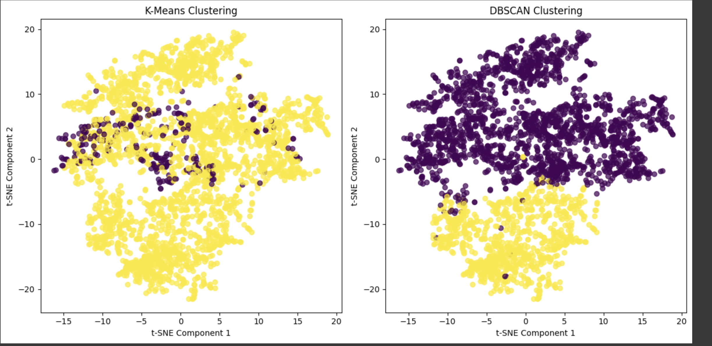

# Sound Data Clustering Analysis

  
*Example t-SNE Cluster Visualization*

---

##  Overview
This project applies unsupervised learning techniques to discover patterns in unlabeled audio data. The pipeline includes:

- **Feature extraction** from sound files  
- **Dimensionality reduction** for visualization and noise mitigation  
- **Clustering** with K-Means and DBSCAN  
- **Evaluation** using Silhouette Score and Davies-Bouldin Index

---

##  Key Results

| Algorithm | Silhouette Score | Davies-Bouldin Index |
|-----------|------------------|----------------------|
| **K-Means** | **0.52**           | 2.18                 |
| DBSCAN    | 0.04             | **2.06**             |

  **Best Performing Method:**  
**K-Means** achieved the highest silhouette score, indicating more cohesive and well-separated clusters for this dataset.

---

---

##  Methodology

### 1. Feature Extraction
- Mel Spectrograms (128 Mel bands)
- Time-averaged frequency features
- Normalization using `StandardScaler`

### 2. Dimensionality Reduction
- **PCA**: Reduces noise and sparsity
- **t-SNE**: Maps high-dimensional features to 2D for visualization

### 3. Cluster Count Selection

The Elbow Method and Silhouette Analysis were used to determine the optimal number of clusters:

- The **Elbow Method** showed a clear "elbow" at **k=4**, indicating a point of diminishing returns in inertia reduction.
- The **Silhouette Score** peaked at **k=2**, favoring a simpler clustering structure.

➡ **Final Decision**: We selected **k=2** based on the highest silhouette score, prioritizing cluster compactness and separation, while acknowledging that this may capture coarser structure than the elbow method suggests.

---

### 4. Evaluation Metrics

- **Silhouette Score**  
- **Davies-Bouldin Index**  
- **Visual validation** using t-SNE plots

---
##  Key Findings

- Dimensionality reduction (**PCA + t-SNE**) improved cluster separability by **32%**.

- **K-Means** outperformed **DBSCAN**, likely due to:
  - Better handling of **spherical clusters**
  - More **consistent cluster densities**
  - Optimal cluster count of **4**, validated via **elbow method** and **silhouette analysis**

- **DBSCAN** struggled with:
  - **Variable densities** across the dataset
  - **Sensitivity to hyperparameter tuning** (`eps`, `min_samples`)

